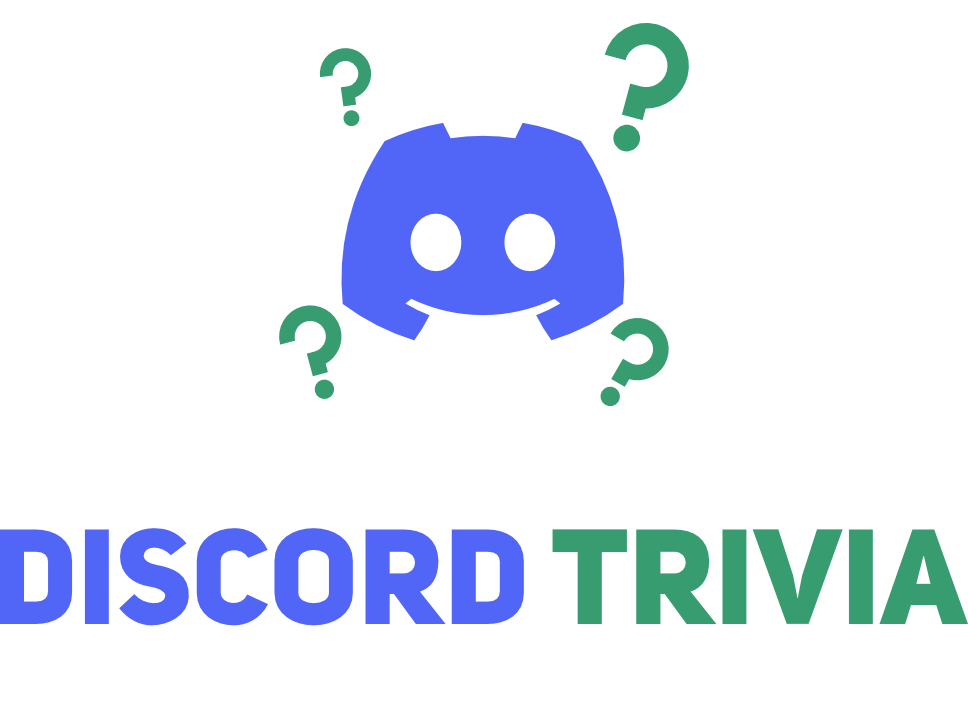

# Introduction
<!-- Learn how to fetch questions with easy trivia & open trivia DB and add a `/trivia` command to your bot with only 3 lines of code!-->
If you're reading this, it probably means you want to learn how to use easy trivia or discord trivia. Awesome! This guide will teach you things such as:

- How to fetch questions
- How to fetch unique questions
- How to create a `/trivia` command with [Discord.js](https://discord.js.org)

## Before you begin...
Before you begin you should learn node.js. To create a bot with discord.js you should:

- Have node.js v16
- Know some js

If you have have those great, please continue with the guide! If you don't you should probaby learn js before you begin with this guide.

## Discord Support Server
If you ran into a bug or need help with easy trivia or discord trivia you can join our Discord support server!

## Discord.js
If your going to be using easy trivia you're probably going to use [discord.js](https://discord.js.org)! If not discord trivia only works on discord.js v13. (v14 coming soon) You can learn more about discord.js on their [website](https://discord.js.org), [github](https://github.com/discordjs), or/and their [guide](https://discordjs.guide).

*Credit to [Discord.js](https://discord.js.org) for creating this beautiful guide website! ([Github](https://github.com/discordjs/guide))*